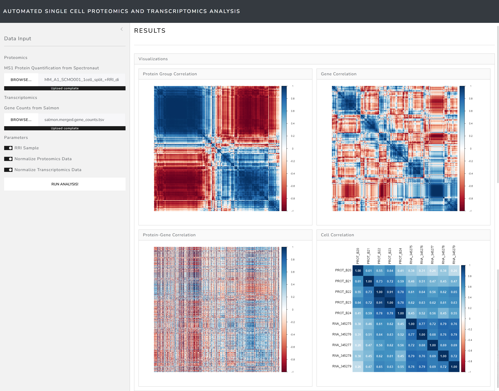

# SCOmics-Preliminary

A preliminary implementation for automated analysis of (single cell) multi-omics proteomics
and transcriptomics data based on preliminary data from the Proteomics Tech Hub of the Research
Institute of Molecular Pathology in Vienna.

Implemented in [Shiny](https://shiny.posit.co/) using [R 4.4.2](https://www.r-project.org/).

Example data is available upon reasonable request.

## Running the App

- Install the [R programming language](https://www.r-project.org/).
- Install the [required packages](_install.R).
- In an R shell run:
  ```R
  shiny::runApp()
  ```

## Screenshots

- **RRI sample using raw gene counts**
  

## Contact

- [micha.birklbauer@fh-hagenberg.at](mailto:micha.birklbauer@fh-hagenberg.at)
